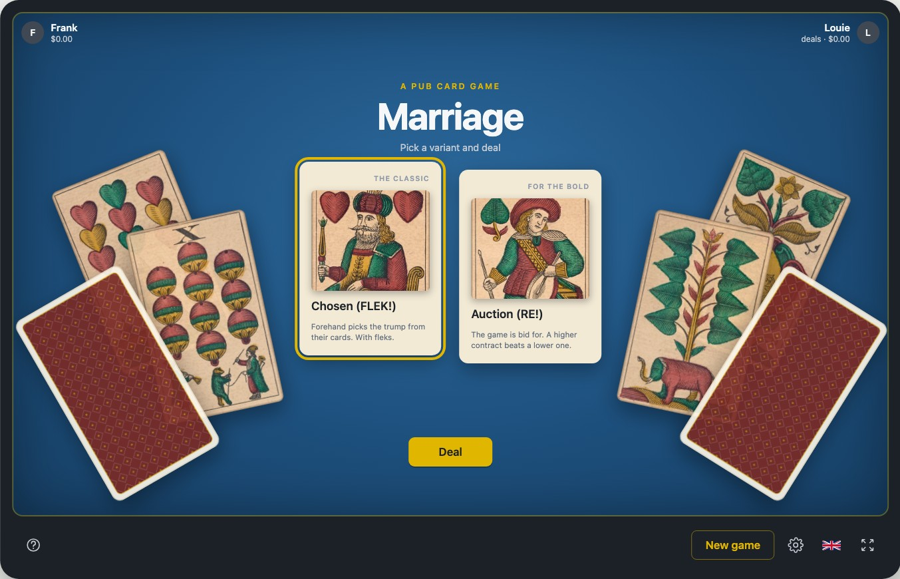

# Flek! — mariáš in the browser

🇬🇧 **English** · 🇨🇿 **[Česky](#česky)**

A modern browser tribute to **FLEK!** (1991–92) and **RE!** (1993), two DOS card
games written in Turbo Pascal by **Ing. Jaroslav Pivoňka** (Pivoňka Software).
They played _mariáš_, the Czech trick-taking game for three players that is
still the standard card game of Czech pubs.

The engine is a pure reducer in TypeScript, the two opponents are a heuristic
plus an Information-Set Monte Carlo tree search running in a Web Worker, and the
whole thing is a static page with no backend.

Live site: **[flek.saiko.cz](https://flek.saiko.cz)**



This project is dedicated to my father, **Josef Saiko**, who loved mathematics.

## The game

Mariáš is played with 32 German-suited cards (acorns, leaves, hearts, bells;
seven through ace) by three players: one **declarer** against two **defenders**.
The declarer takes the talon, discards two cards and commits to a contract; the
defenders may double it. Ten tricks are played, aces and tens are worth ten
points each, the last trick another ten, and a king with the ober of the same
suit is worth 20 (40 in trumps) when its holder announces it while playing the
first card of the pair.

Two variants ship, both playable from the opening screen:

| Variant                  | Original | How the contract is decided                                                                                                    |
| ------------------------ | -------- | ------------------------------------------------------------------------------------------------------------------------------ |
| **Chosen** (volený)      | FLEK!    | Forehand picks the trump from their first seven cards and announces the game. Opponents may only take over with betl or durch. |
| **Auction** (licitovaný) | RE!      | Players bid for the contract; a higher commitment beats a lower one, and the winner takes the talon.                           |

Beyond the plain game, players commit to **seven** (winning the last trick with
the trump seven), **hundred** (scoring 100 points or more), **betl** (losing
every trick) and **durch** (winning every one). Each component is doubled
independently through the _flek_ ladder — flek, re, tutti, boty, kalhoty — and a
red trump doubles the colour contracts again.

The UI speaks Czech, English, German and French, and the money is kept across
hands in a running account.

### Rules

The engine follows the **official rules of the Czech Mariáš Association**
(Český svaz mariáše) for the part of the game it implements: three-handed
chosen and auction mariáš, played for money. This repository does not
redistribute the rules; these links point to the documents at their own
source:

- [Obecná pravidla hry mariáš 2009](https://www.csm1986.cz/public/CMS_Materialy/00_Spolecne_pro_vsechny_druhy_mariase/Dokumenty_CMS/Obecna_pravidla_hry_marias_2009.pdf) — the general rules, on the association's own site
- [Pravidla dvacetihaléřového bodovaného voleného mariáše](https://www.talon.cz/pravidla/mari%C3%A1%C5%A1_pravidla_volen%C3%BD.pdf) — the chosen variant
- [Pravidla soutěžního licitovaného mariáše (2014)](https://www.talon.cz/pravidla/mari%C3%A1%C5%A1_pravidla_licitovan%C3%BD_2014.pdf) — the auction variant
- [Český svaz mariáše](https://www.csm1986.cz/) — the association itself

Where the original games disagree with those rules, the association wins by
default and the FLEK! behaviour goes behind a config switch. Every such decision
is recorded in [`docs/marias-design.md`](docs/marias-design.md), which is the
living design document for the whole project.

What the rules describe and this engine deliberately does not do:

- the **two sevens** contract of the auction variant, and with it the "mistake"
  by which a player who bid a seven they do not hold folds the hand;
- **laydown hands**: spotting that a contract cannot be lost is solving the
  hand rather than settling it, and the rules then split the difference among
  the players who flekked. The 500x/750x limit is applied, that split is not;
- **tournament machinery**: premium points, the fourth player sitting a hand
  out, cutting and stacking the cards, and most of the renonces;
- a player raises at most **one component per turn**, where the rules let them
  answer every part of the contract in one breath;
- the middle player's position in the auction is fixed rather than inherited
  from whoever drops out first.

In English, the game is usually called **Marriage**; the [pagat.com description
of mariáš](https://www.pagat.com/marriage/marias.html) is a good introduction.

## Original work and references

- [FLEK! playable in the browser](https://www.retrogames.cz/play_448-DOS.php?language=CZ) at retrogames.cz
- FLEK! v1.12 © 1991, 1992 and RE! © 1993 Ing. Jaroslav Pivoňka, Pivoňka Software

This is an independent reimplementation, not a port. The repository contains
**no original executable and no original code**; the games were used as a
reference for the feel of the table and for default rates, and what was
observed is written down in [`docs/original-notes.md`](docs/original-notes.md).
One thing was deliberately not reproduced: the original AI was widely said to
peek at the other hands. Here the opponents receive a redacted view and cannot.
That claim is a test, not a promise: every field of every player's view is
checked against the cards that player may not know, and the seed the search
runs on is drawn independently of the one that shuffled the deck, so the deal
cannot be reconstructed from it.

## Run locally

```bash
make setup
make dev
```

Checks and build:

```bash
make verify        # engine tests, no browser (76 blocks of assertions)
make smoke         # browser tests (Playwright: Chromium + WebKit)
make all           # verify + build + smoke
make preview
make capture       # regenerate the README screenshot
```

Any deal can be reproduced by adding a seed to the URL: `?seed=10` deals the
same cards every time, and subsequent hands continue from that seed.

## Architecture

```text
src/lib/cards.ts               card encoding, orders, points
src/lib/rules/types.ts         GameState, Phase, PlayerAction, Contract, Sazby
src/lib/rules/legal.ts         legalActions() — the single source of legality
src/lib/rules/engine.ts        apply(state, action) → state, invariants
src/lib/rules/scoring.ts       settlement, per-component, zero sum
src/lib/rules/view.ts          view(state, seat) → PlayerView, hides other hands
src/lib/ai/heuristics.ts       hand evaluation for every auction decision
src/lib/ai/ismcts.ts           Information-Set MCTS for card play
src/worker/ai.worker.ts        the AI off the main thread
src/lib/match/controller.ts    match loop, autosave, AI scheduling
src/lib/ui/table.ts            the table: rendering, animations, popups
src/pages/index.astro          the page and all of its CSS
scripts/verify.ts              engine tests
scripts/smoke.ts               browser tests
```

Three decisions shape everything else:

**`legalActions(view)` is the only place that knows the rules.** `apply()`
validates an action by membership in that list rather than deriving legality a
second time, so the UI, the AI and the validator cannot drift apart.

**`apply()` is pure and deterministic**, which makes a match a fold over its
history: `history.reduce(apply, dealtState)`. Replay, autosave and a future
multiplayer server all fall out of that one property.

**The AI only ever sees a `PlayerView`.** Fair play is enforced by construction,
and the same redacted object is what a server would send to a remote client.

The table is sized from the **height of the felt** (`container-type: size` plus
`cqh` units), because the layout is height-constrained: the opponents, the trick
and your hand have to fit above each other. The proportions therefore hold in a
window, in fullscreen and at other aspect ratios.

## Cards

- `cards/history/` — scans of a single-headed Prague pattern deck printed
  around 1860 by Ant. Kratochvíl, Prague. **Public domain**, via
  [Wikimedia Commons](https://commons.wikimedia.org/wiki/Category:Jednohlave)
  (original scans: Bibliothèque nationale de France, Gallica).
- `cards/modern/` and its `-en`, `-de`, `-fr` variants — an original SVG deck
  generated by [`scripts/gen-cards.ts`](scripts/gen-cards.ts), **MIT licensed**.
  Edit the generator, not the files.

## Deployment

The site has its own bucket and distribution: `dist/` is synced to
`s3://flek.saiko.cz/` and the distribution is invalidated. `make deploy-s3-dryrun`
shows what would change. Credentials and bucket names live in `Makefile.local`,
which is deliberately not in the repository.

## License

The code in this repository is MIT licensed. FLEK!, RE! and the original work
remain the work of Ing. Jaroslav Pivoňka. The rules of mariáš belong to no one;
the specific wording of the association's documents belongs to the association,
which is why they are linked rather than copied.

---

<a id="česky"></a>

## Česky

Moderní browserová pocta hrám **FLEK!** (1991–92) a **RE!** (1993), které
v Turbo Pascalu napsal **Ing. Jaroslav Pivoňka** (Pivoňka Software). Hraje se
mariáš pro tři hráče — volený i licitovaný — podle **oficiálních pravidel
Českého svazu mariáše**, na která se odkazuje (nekopírují se sem, je to cizí
dílo). Engine je čistý reducer v TypeScriptu, protihráči jsou heuristika plus
ISMCTS ve Web Workeru a celé je to statická stránka bez backendu.

Věnováno mému otci, **Josefu Saikovi**, který miloval matematiku.

Živý web: **[flek.saiko.cz](https://flek.saiko.cz)**

```bash
make setup
make dev
make all           # verify + build + smoke
make capture       # znovu vytvoří snímek pro README
```

Rozdání jde zopakovat seedem v URL: `?seed=10` rozdá pokaždé stejné karty.
Živý návrhový dokument je [`docs/marias-design.md`](docs/marias-design.md),
pozorované chování originálu [`docs/original-notes.md`](docs/original-notes.md).

Kód je pod MIT. FLEK! a RE! zůstávají dílem Ing. Jaroslava Pivoňky; originální
binárky v repu nejsou a tenhle projekt není jejich port, ale samostatná
implementace. Na rozdíl od originálu tady AI do cizích karet nevidí — dostává
jen redigovaný `PlayerView`, a hlídá to test, který prochází celý pohled i seed
hledání. Podporovaná podmnožina pravidel a vědomé odchylky jsou popsané výš
v anglické části a v [`docs/marias-design.md`](docs/marias-design.md).
